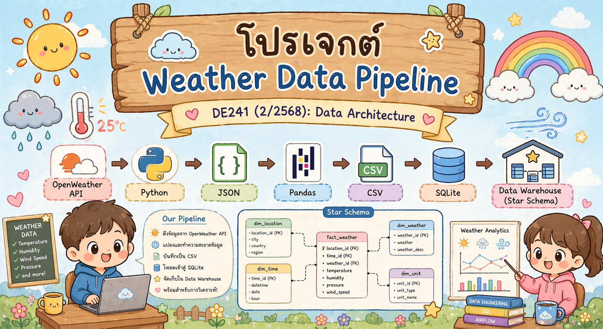
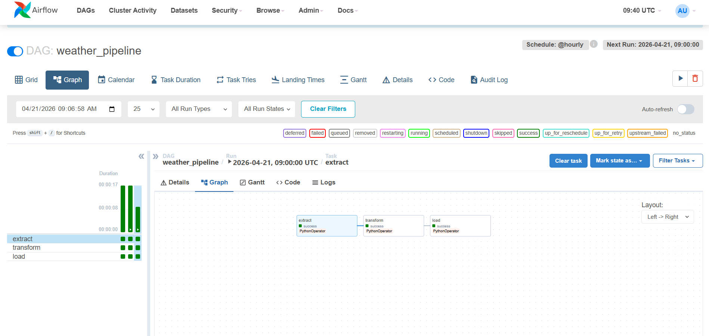
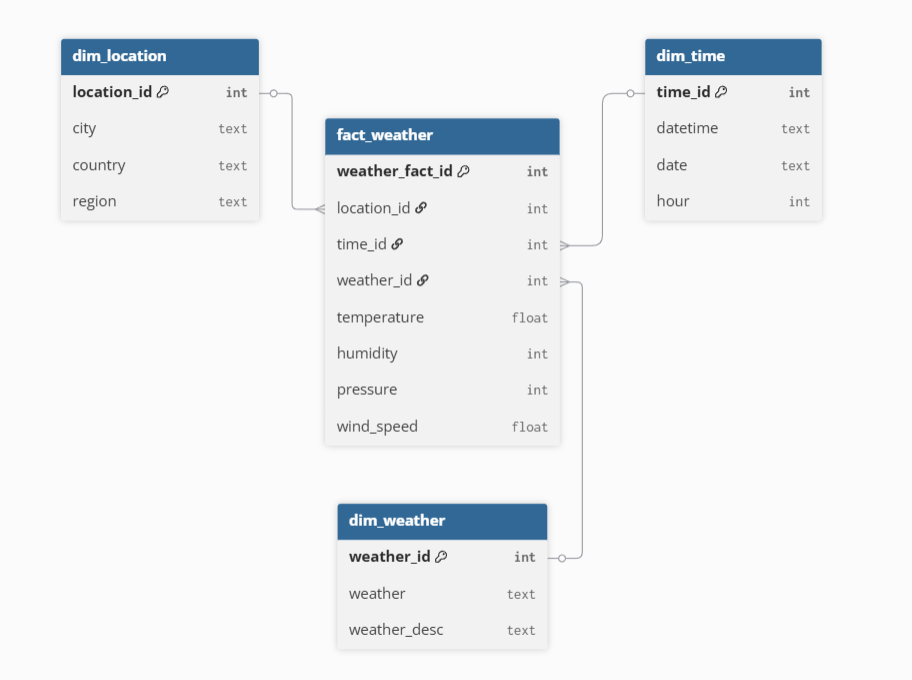
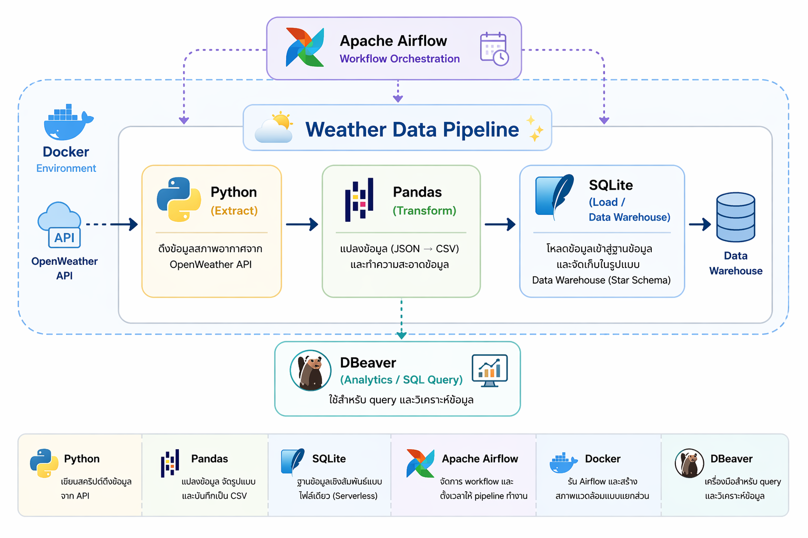
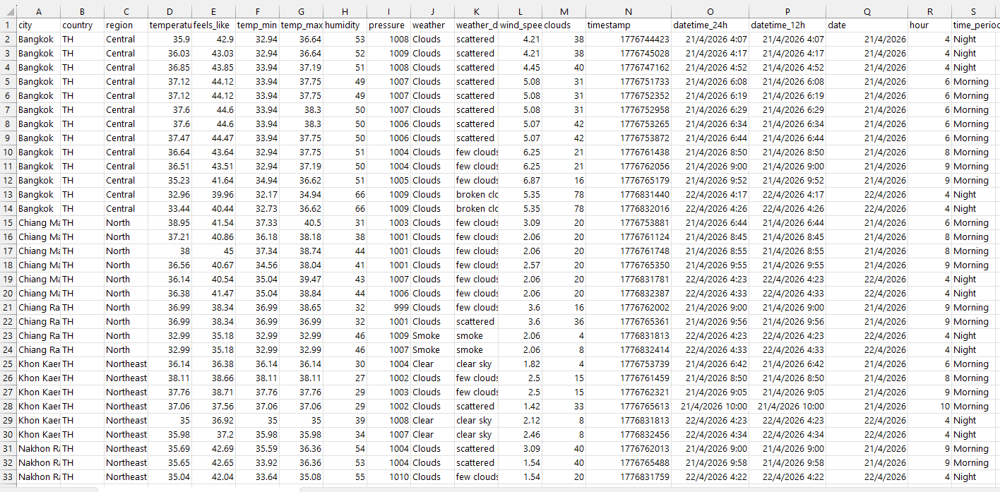
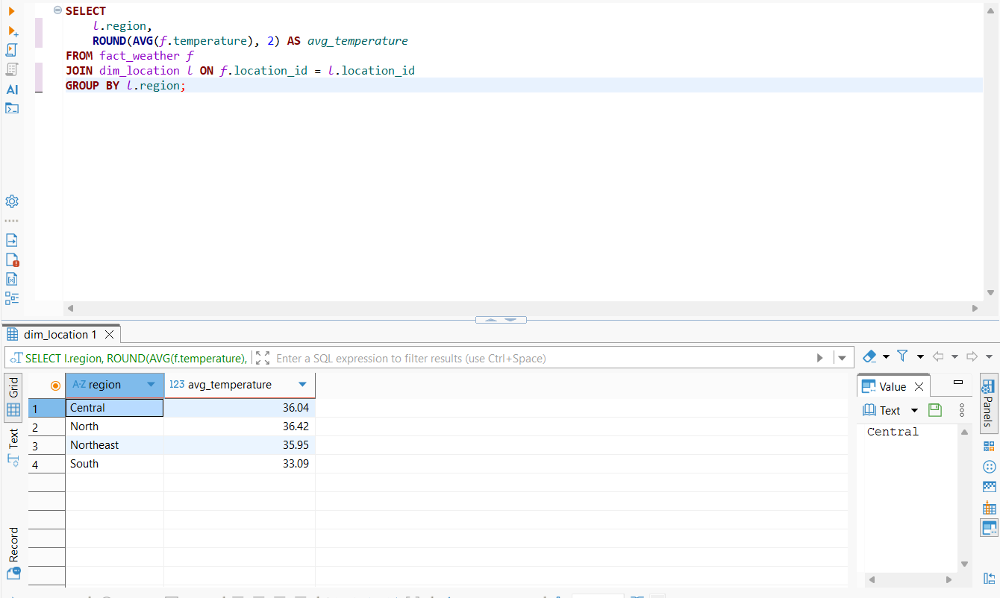
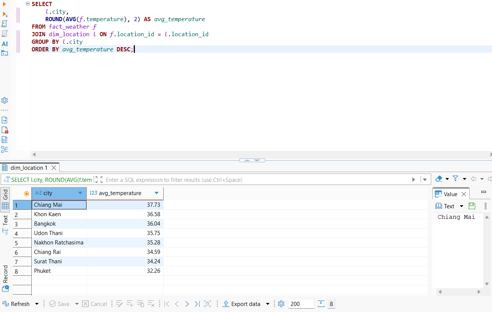
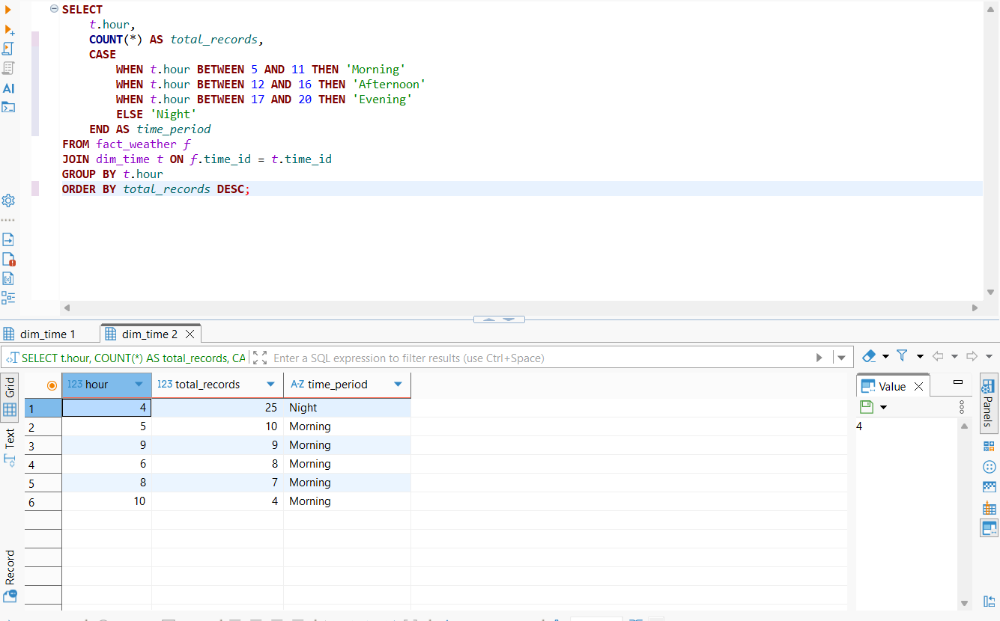
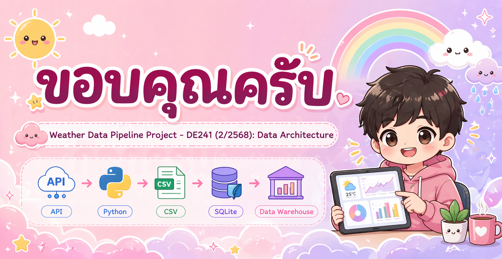

# 🌦 Weather Data Pipeline

## (โครงงานวิชา Data Architecture - DE241)


---

## 1. ภาพรวมโปรเจกต์ (Overview)

โปรเจกต์นี้เป็นการพัฒนาระบบ **Data Pipeline แบบ End-to-End** สำหรับดึงข้อมูลสภาพอากาศจาก **OpenWeather API** ซึ่งเป็น Public Data Source

ระบบถูกออกแบบให้สามารถทำงานอัตโนมัติ โดยมีขั้นตอนหลักตามแนวคิดของ Data Engineering ได้แก่:

* **Extract (E)**: ดึงข้อมูลสภาพอากาศจาก API
* **Transform (T)**: แปลงข้อมูลจาก JSON ให้อยู่ในรูปแบบที่เหมาะสมต่อการใช้งาน
* **Load (L)**: จัดเก็บข้อมูลลงในฐานข้อมูล

ข้อมูลทั้งหมดจะถูกจัดเก็บในรูปแบบ **Data Warehouse (Star Schema)** เพื่อรองรับการวิเคราะห์ข้อมูล เช่น การเปรียบเทียบอุณหภูมิในแต่ละภูมิภาค และการวิเคราะห์ตามช่วงเวลา

---

## 2. วัตถุประสงค์ของโปรเจกต์

* เพื่อศึกษาการออกแบบ Data Pipeline ตั้งแต่ต้นจนจบ
* เพื่อฝึกการออกแบบ Data Model แบบ Star Schema
* เพื่อเรียนรู้การใช้เครื่องมือ Data Engineering เช่น Apache Airflow และ SQLite
* เพื่อสามารถนำข้อมูลไปวิเคราะห์เชิงธุรกิจ (Analytics) ได้

---

## 3. ขอบเขตของข้อมูล (Data Scope)

ข้อมูลที่ใช้ในโปรเจกต์นี้เป็นข้อมูลสภาพอากาศของ **เมืองตัวแทนในแต่ละภูมิภาคของประเทศไทย** เช่น Bangkok, Chiang Mai, Phuket และ อื่นๆ

อันเนื่องมาจากข้อจำกัดของ API และเพื่อความเหมาะสมในการทดลอง ระบบจึงไม่ได้เก็บข้อมูลจากทุกจังหวัด แต่เลือกใช้ “Representative Cities” เพื่อเป็นตัวแทนของแต่ละภูมิภาคในการวิเคราะห์ตัวโปรเจคนี้ครับ นอกจากนี้ ข้อมูลที่ใช้ในระบบเป็นข้อมูลที่ถูกดึงจาก API แบบอัตโนมัติ  (Automated Data Ingestion) โดยเป็นข้อมูลที่อัปเดตตามเวลาจริง (Near Real-Time) ผ่านการตั้ง schedule ใน Airflow 

ดังนั้นข้อมูลที่ใช้ในโปรเจกต์นี้จึงไม่ใช่ static dataset ที่เตรียมไว้ล่วงหน้า แต่เป็นข้อมูลที่ถูกดึงเข้ามาใหม่ในแต่ละรอบของการทำงานของ pipeline

---

## 4. สถาปัตยกรรมระบบ (Architecture)

ระบบนี้ถูกออกแบบเป็น Data Pipeline โดยมีลำดับการทำงานดังนี้:

1. ดึงข้อมูลสภาพอากาศจาก OpenWeather API (Extract)
2. จัดเก็บข้อมูลดิบในรูปแบบ JSON (Raw Data)
3. แปลงข้อมูลให้อยู่ในรูปแบบที่เหมาะสม (Transform)
4. บันทึกข้อมูลเป็นไฟล์ CSV (Processed Data)
5. โหลดข้อมูลเข้าสู่ฐานข้อมูล SQLite (Load)
6. จัดเก็บข้อมูลในรูปแบบ Data Warehouse (Star Schema)

---

### 5. Data Flow

```text id="r3qslf"
OpenWeather API
        ↓
    Extract (Python)
        ↓
    Raw Data (JSON)
        ↓
    Transform (Pandas)
        ↓
    Processed Data (CSV)
        ↓
    Load (SQLite)
        ↓
    Data Warehouse (Star Schema)

```



---

## 6. การออกแบบข้อมูล (Data Modeling)

โปรเจกต์นี้ออกแบบฐานข้อมูลในรูปแบบ **Star Schema** ซึ่งเหมาะสำหรับการวิเคราะห์ข้อมูล (Analytical Processing)

โครงสร้างประกอบด้วย:



### Fact Table

* `fact_weather`

  * เก็บข้อมูลเชิงตัวเลข เช่น temperature, humidity, pressure, wind_speed

### Dimension Tables

* `dim_location` → เก็บข้อมูลเมือง ประเทศ และภูมิภาค
* `dim_time` → เก็บข้อมูลวัน เวลา และชั่วโมง
* `dim_weather` → เก็บประเภทสภาพอากาศ

การออกแบบนี้ช่วยให้สามารถ query และวิเคราะห์ข้อมูลได้อย่างมีประสิทธิภาพ

---

## 7. เครื่องมือที่ใช้ (Tools & Technologies)



* Python → ใช้สำหรับพัฒนา pipeline
* Pandas → ใช้ในการแปลงข้อมูล (Transform)
* SQLite → ใช้เป็นฐานข้อมูล (Data Warehouse)
* Apache Airflow → ใช้จัดการ workflow และ schedule pipeline
* Docker → ใช้รัน Airflow environment
* DBeaver → ใช้สำหรับ query และวิเคราะห์ข้อมูล

---
## 8. โครงสร้างโปรเจกต์ (Project Structure)

```text
weather-data-pipeline/
│
├── config/
│   └── config.json          # เก็บ configuration เช่น API URL และรายชื่อเมือง
│
├── dags/
│   └── weather_pipeline.py  # กำหนด workflow ของ Airflow
│
├── scripts/
│   ├── extract.py           # ดึงข้อมูลจาก API
│   ├── transform.py         # แปลงข้อมูล
│   ├── load.py              # โหลดข้อมูลเข้าสู่ฐานข้อมูล
│   └── query.py             # ใช้สำหรับทดสอบ query
│
├── data/
│   ├── raw/                 # เก็บข้อมูลดิบ (JSON)
│   ├── processed/           # เก็บข้อมูลหลังแปลง (CSV)
│   └── weather.db           # ฐานข้อมูล SQLite (Data Warehouse)
│
├── models/
│   └── schema.sql           # โครงสร้างตาราง (Star Schema)
│
├── images/
│   ├── airflow.png          # รูป workflow จาก Airflow
│   └── schema.png           # รูป Data Model
│
├── docker-compose.yml       # ใช้รัน Airflow
├── requirements.txt         # รายชื่อ library ที่ใช้
└── README.md                # เอกสารอธิบายโปรเจกต์
```
---

## 9. ตัวอย่างข้อมูลและการแปลงข้อมูล (Data Transformation)

หลังจากทำขั้นตอน Extract แล้ว ข้อมูลที่ได้จาก OpenWeather API จะอยู่ในรูปแบบ JSON ซึ่งเป็นข้อมูลแบบ nested structure และยังไม่เหมาะสมต่อการนำไปวิเคราะห์โดยตรง ดังนั้นจึงต้องมีการแปลงข้อมูล (Transform)

### โครงสร้างข้อมูลก่อนแปลง (Raw Data)

ข้อมูลจาก API จะมีโครงสร้าง JSON เช่น:

* coord → พิกัด (lat, lon)
* weather → ประเภทสภาพอากาศ (main, description)
* main → temperature, humidity, pressure
* wind → wind speed
* dt → timestamp
* name → ชื่อเมือง
* sys → country

ตัวอย่างข้อมูลจริง:

```json
{
  "name": "Bangkok",
  "main": {
    "temp": 34.12,
    "humidity": 66,
    "pressure": 1008
  },
  "weather": [
    {
      "main": "Clouds",
      "description": "broken clouds"
    }
  ],
  "wind": {
    "speed": 5.62
  },
  "dt": 1776833820,
  "sys": {
    "country": "TH"
  }
}
```

(ข้อมูลจริงอ้างอิงจาก API response)

---

### โครงสร้างข้อมูลหลังแปลง (Processed Data)

หลังจากการแปลงข้อมูล ข้อมูลจะถูก flatten และจัดเก็บในรูปแบบ CSV ซึ่งอยู่ในรูปแบบตาราง (Tabular Format) โดยมีโครงสร้างดังนี้:

* city → ชื่อเมือง
* country → ประเทศ
* region → ภูมิภาค
* temperature → อุณหภูมิ (°C)
* feels_like → อุณหภูมิที่รู้สึก (°C)
* temp_min → อุณหภูมิต่ำสุด (°C)
* temp_max → อุณหภูมิสูงสุด (°C)
* humidity → ความชื้น (%)
* pressure → ความกดอากาศ (hPa)
* weather → ประเภทสภาพอากาศ
* weather_desc → รายละเอียดสภาพอากาศ
* wind_speed → ความเร็วลม
* clouds → ปริมาณเมฆ (%)
* timestamp → เวลาแบบ Unix timestamp
* datetime_24h → วันเวลาแบบ 24 ชั่วโมง
* datetime_12h → วันเวลาแบบ 12 ชั่วโมง
* date → วันที่
* hour → ชั่วโมง
* time_period → ช่วงเวลา (Morning, Afternoon, Evening, Night)

---

### ขั้นตอนการแปลงข้อมูล (Transformation Process)

กระบวนการ Transform ใน Data Pipeline นี้ประกอบด้วยขั้นตอนหลักดังนี้:

* แปลงค่า timestamp (dt) เป็น datetime
* ดึงข้อมูลจากโครงสร้าง JSON แบบ nested เช่น:
* main.temp → temperature
* main.feels_like → feels_like
* main.temp_min → temp_min
* main.temp_max → temp_max
* weather[0].main → weather
* weather[0].description → weather_desc
* wind.speed → wind_speed
* clouds.all → clouds
* สร้างคอลัมน์ใหม่ (Derived Columns):
* datetime_24h, datetime_12h → แปลงจาก timestamp
* date → แยกจาก datetime
* hour → แยกจาก datetime
* time_period → แบ่งช่วงเวลา เช่น Morning / Afternoon / Evening / Night
* ทำการ map ข้อมูล:
* city → region (เช่น Bangkok → Central)
* ลบข้อมูลซ้ำ (Duplicate Removal):
* ใช้ city + timestamp เป็น key
* รวมข้อมูลให้อยู่ในรูปแบบตาราง (Tabular Format)
* บันทึกข้อมูลเป็นไฟล์ CSV เพื่อใช้ในขั้นตอน Load
* ประโยชน์ของการแปลงข้อมูล (Benefits of Transformation)

### การแปลงข้อมูลช่วยให้:

* ข้อมูลอยู่ในรูปแบบโครงสร้าง (Structured Data)
* รองรับการออกแบบ Data Warehouse แบบ Star Schema
* สามารถ query และวิเคราะห์ข้อมูลด้วย SQL ได้ง่าย
* ลดความซับซ้อนของข้อมูลแบบ nested JSON
* เพิ่มความสามารถในการวิเคราะห์เชิงเวลา (Time-based Analysis)

ภาพตัวอย่างข้อมูลหลังแปลง:



---

## 10. การวิเคราะห์ข้อมูล (Analytics)

ตัวอย่างการวิเคราะห์ข้อมูลจาก Data Warehouse โดยใช้ SQL

---

### 10.1 อุณหภูมิเฉลี่ยรายภูมิภาค

```sql
SELECT 
    l.region,
    ROUND(AVG(f.temperature), 2) AS avg_temperature
FROM fact_weather f
JOIN dim_location l ON f.location_id = l.location_id
GROUP BY l.region
ORDER BY avg_temperature DESC;
```



---

### 10.2 อุณหภูมิเฉลี่ยรายเมือง

```sql
SELECT 
    l.city,
    ROUND(AVG(f.temperature), 2) AS avg_temperature
FROM fact_weather f
JOIN dim_location l ON f.location_id = l.location_id
GROUP BY l.city
ORDER BY avg_temperature DESC;
```



---

### 10.3 การกระจายข้อมูลตามช่วงเวลา

```sql
SELECT 
    t.hour,
    COUNT(*) AS total_records,
    CASE 
        WHEN t.hour BETWEEN 5 AND 11 THEN 'Morning'
        WHEN t.hour BETWEEN 12 AND 16 THEN 'Afternoon'
        WHEN t.hour BETWEEN 17 AND 20 THEN 'Evening'
        ELSE 'Night'
    END AS time_period
FROM fact_weather f
JOIN dim_time t ON f.time_id = t.time_id
GROUP BY t.hour
ORDER BY total_records DESC;
```



---

## 11. Insight จากข้อมูล

จากการวิเคราะห์ข้อมูลพบว่า:

### ด้านภูมิภาค (Region)

* ภาคเหนือมีอุณหภูมิเฉลี่ยสูงที่สุด ≈ **36.42°C**
* ภาคกลางมีอุณหภูมิเฉลี่ย ≈ **36.04°C**
* ภาคตะวันออกเฉียงเหนือมีอุณหภูมิเฉลี่ย ≈ **35.95°C**
* ภาคใต้มีอุณหภูมิเฉลี่ยต่ำที่สุด ≈ **33.09°C**

---

### ด้านเมือง (City)

* Chiang Mai มีอุณหภูมิเฉลี่ยสูงที่สุด ≈ **37.73°C**
* Khon Kaen ≈ **36.58°C**
* Bangkok ≈ **36.04°C**
* Phuket มีอุณหภูมิต่ำที่สุด ≈ **32.26°C**

---

### ด้านเวลา (Time Analysis)

* ช่วงเวลา **04:00 (Night)** มีจำนวนข้อมูลมากที่สุด ≈ **25 records**
* รองลงมาคือช่วง **05:00 (Morning)** ≈ **10 records**
* ช่วงเวลา **09:00** ≈ **9 records**
* แสดงให้เห็นว่า pipeline ทำงานแบบ scheduled (Batch Processing) และมีการรันในช่วงเวลาที่กำหนด

---

### มุมมองด้าน Data Architecture

การออกแบบ Data Warehouse แบบ Star Schema ช่วยให้:

* สามารถ join ระหว่าง fact และ dimension ได้ง่าย
* รองรับการวิเคราะห์ข้อมูลหลายมิติ (Multi-dimensional Analysis)
* ลดความซับซ้อนของ query และเพิ่มประสิทธิภาพในการวิเคราะห์

---

## 12. สรุป (Conclusion)

โปรเจกต์นี้แสดงให้เห็นการพัฒนา Data Pipeline แบบ End-to-End ตั้งแต่การดึงข้อมูลจาก API (Extract) การแปลงข้อมูล (Transform) ไปจนถึงการจัดเก็บในรูปแบบ Data Warehouse (Load)

ข้อมูลถูกจัดเก็บในรูปแบบ Star Schema ซึ่งเหมาะสำหรับการวิเคราะห์ (Analytical Processing) และสามารถนำไปต่อยอดในระบบ Business Intelligence (BI) หรือ Dashboard ได้ในอนาคต

นอกจากนี้ pipeline ยังสามารถทำงานแบบอัตโนมัติ (Scheduled Batch Processing) ผ่าน Apache Airflow ทำให้สามารถรองรับการเก็บข้อมูลแบบต่อเนื่องได้


---

## 13. การติดตั้ง (Installation)

ติดตั้ง dependencies ที่จำเป็นสำหรับโปรเจกต์:

```bash
pip install -r requirements.txt
```

---

## วิธีรันระบบ (Run Pipeline)

สามารถรันระบบผ่าน Docker เพื่อเริ่ม Apache Airflow และ Data Pipeline ได้ดังนี้:

```bash
docker-compose up
```

หลังจากนั้นสามารถเข้าใช้งาน Airflow UI ได้ที่:

```
http://localhost:8080
```

---

## 14. แนวทางการพัฒนาต่อ (Future Improvements)

โปรเจกต์นี้สามารถพัฒนาต่อยอดได้ในหลายด้าน เช่น:

* รองรับการเก็บข้อมูลระยะยาว (Historical Data) เพื่อการวิเคราะห์แนวโน้ม
* เพิ่ม Dashboard สำหรับแสดงผลข้อมูล (เช่น Power BI หรือ Tableau)
* เปลี่ยนจาก SQLite ไปใช้ Data Warehouse ระดับ Production เช่น PostgreSQL หรือ BigQuery
* เพิ่มระบบ Data Quality Check เพื่อตรวจสอบความถูกต้องของข้อมูลอัตโนมัติ


<p align="center">
  
</p>